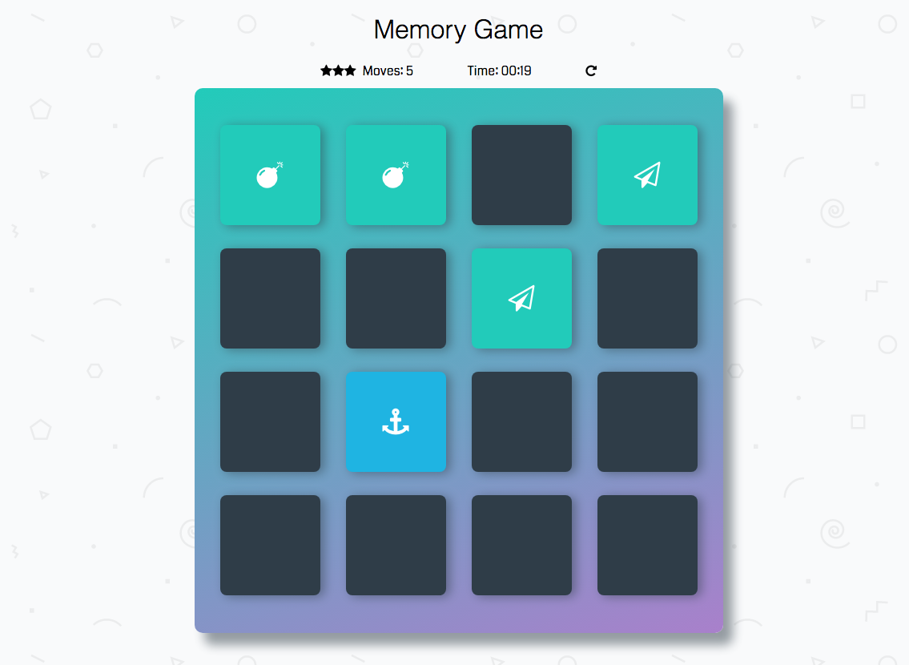

# Memory Game Project

[**Play Game**](https://blitnee.github.io/Memory-Game/)

## About

This game was created for a project in the Udacity Front End Developer Nanodegree.

## Instructions

1. Click on any two cards to find a match.
2. If a match has been found, the two cards selected will remain exposed and turn green.
3. If a match has not been found, the clicked cards will flip back to face down.
4. When all cards have been matched, the player wins the game.
5. Players have 2:00 minutes to find all matches and win the game.
6. At the end of the game, a player will be notified of their star rating (based on time), number of moves, and time.
7. Matched cards do not count as a move.
8. Ideally, a player would win within the 3 star timezone with the least amount of moves possible.
9. Players can restart the game at any time.

## Star Rating Breakdown

* :star: = Solved under 1:00 min

* :star::star: = Solved under 45 sec

* :star::star::star: = Solved under 30 sec

## Code Dependencies

The app has no code dependencies and was built using HTML, CSS, and JS.
